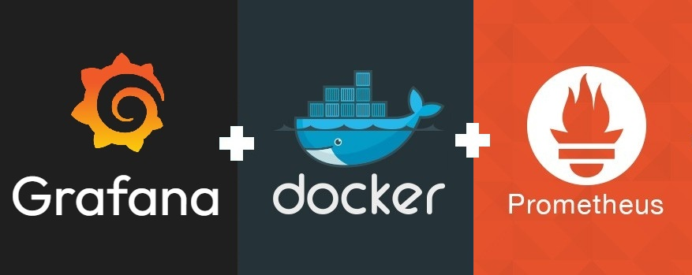

<h1 id="top" align="center">Monitor Grafana <br/> 🚢 v1.2.0 🚢</h1>

<br>

<div align="center">
    
</div>

<br>

## 🔍 Table of Contents

- [Features](#features)
- [System Startup](#system-startup)

<br/>

<h2 id="features">🔥 Features</h2>

- **Docker Containerization:** The application is containerized using Docker to ensure consistent deployment, scalability, and isolation across different environments.
- **Persistent Data:** Utilizes bind mounts to persist data on the host machine, preventing data loss during container restarts.
- **Docker Compose Deployment:** Simplifies deployment with Docker Compose configuration, enabling easy setup and service orchestration without complex commands.
- **Prometheus Integration:** Seamlessly integrates with Prometheus to visualize real-time monitoring data.
- **Loki Integration:** Seamlessly integrates with Loki to visualize real-time logs.
- **Dashboard & Datasource Provisioning:** Comes with a prepared JSON dashboard and predefined data sources, automatically loaded using provisioning files.
- **Pre-configured Dashboards:** Comes with ready-to-use dashboards for Traefik, Docker, and Node Exporter, offering instant insights into system performance.
- **Email Alerts Support:** predefined email configuration to set alert rules.
- **Predefined Admin Credentials:** Allows the use of a predefined admin password stored in a `.env` file.

<br/>

<h2 id="system-startup">🚀 System Startup</h2>

- Create a new directory named `monitor`.

```
mkdir monitor
cd monitor
```

- Clone project.

```
git clone https://github.com/ahmettoguz/monitor-grafana
cd monitor-grafana
```

- Check `provisioning` directory for further dashboard and datasource configuration.

- Create `.env` file based on the `.env.example` file with credentails.

```
cp .env.example .env
```

- Create `mount` directory and change file permissions.

```
mkdir mount
chmod -R 775 ./mount
```

- Create `network-monitor` network if not exists.

```
docker network create network-monitor
```

- Run container.

```
docker stop                             monitor-grafana-c
docker rm                               monitor-grafana-c
docker compose -p monitor up --build -d grafana
docker compose -p monitor up -d         grafana
docker logs -f                          monitor-grafana-c
```

- Refer to [`cAdvisor`](https://github.com/ahmettoguz/monitor-cadvisor) repository to expose contianer metrics.

- Refer to [`Node-Exporter`](https://github.com/ahmettoguz/monitor-node-exporter) repository to expose node metrics.

- Refer to [`Prometheus`](https://github.com/ahmettoguz/monitor-prometheus) repository to integrate prometheus to scrap metrics.

- Refer to [`Promtail`](https://github.com/ahmettoguz/monitor-promtail) repository to push traefik access logs to Loki.

- Refer to [`Loki`](https://github.com/ahmettoguz/monitor-loki) repository to scrap traefik access logs from promtail.

- Refer to [`Traefik`](https://github.com/ahmettoguz/core-traefik) repository to expose traefik access logs, metrics and also launch reverse proxy.

<br/>

### [🔝](#top)
